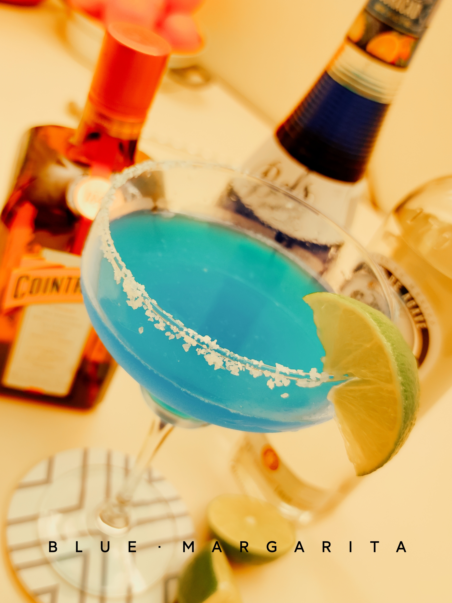

# CocktailPedia 

## Team Members

| Name             | Email                   |
|------------------|---------------------------|
| Ruichen Zhang   | ruichenz@seas.upenn.edu |
| Rui Zhang         | ruizhan@seas.upenn.edu     |
| Wenrui Zhang  | wrzhang@sas.upenn.edu  |
| Yuxin Hu           | yuxinhu@seas.upenn.edu |

## Description

CocktailPedia is a Java-based cocktail recommender system. It uses cocktail datasets on the web as the data source to provide recipe lookup and recommendations for users. It also allows users to customize their own recipes, and export them in a text file format.

## Main Features

1. Recipe Query: Request cocktail recipe by name, get details on drink name, category, glassware, ingredients, taste, and preparation instructions.

2. Recommendation: Recommends classic recipes by default for new users, and based on user's taste preference for others. Increases the popularity of the recommended recipe for future recommendations. A more complex algorithm based on multiple factors will be designed later.

3. Discount Combo: Recommends discounted cocktail combos by calculating the best discount of cocktail combo sets based on user's choice of two drinks.

4. Recipe Customization: Customize cocktail recipe by selecting ingredients, preparation style, and taste. Generates recipe in a text file format.

All features are accessible through the console. The program will accept user input, execute corresponding functions, and print the recipes and helper information based on user options. User's recipe files are stored under their respective username directory.

## Data Structures & Algorithms

We use various data structures such as hash tables, sorted maps, and Trie trees to store and efficiently retrieve cocktail recipes. To implement the discount combo feature, we use a graph to store drinks on discount as vertices and their discount ratio as weighted edges. We use breadth-first search to search for matching recipes and Dijkstra's Algorithm to recommend combos with the best discount.

## References

1. https://www.kaggle.com/datasets/ai-first/cocktail-ingredients
